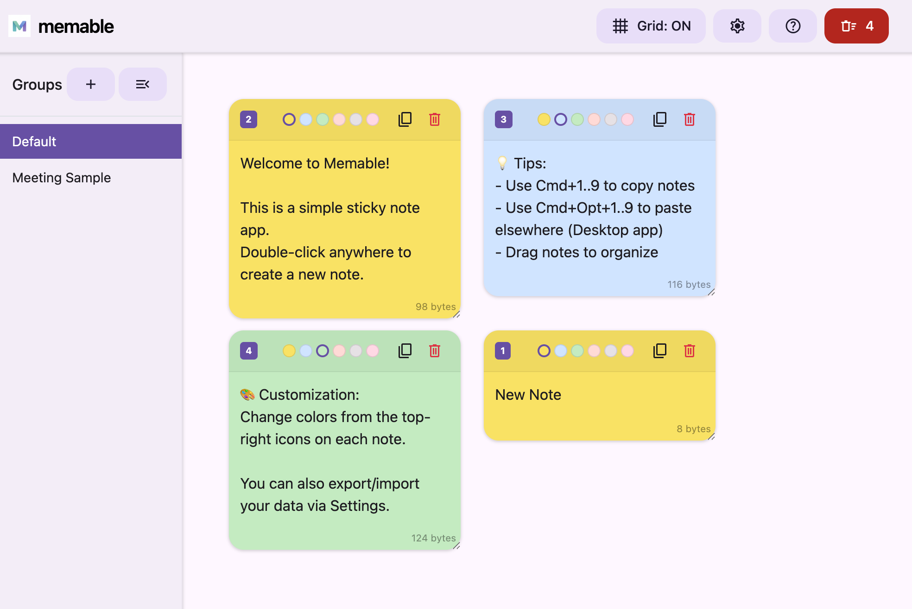

# memable


A temporary copy-and-paste sticky-note web application (PWA-enabled) with native app support via Electron.



## Features
- Create, edit, delete, and copy text notes
- Save image notes via clipboard paste or drag-and-drop
- Move and resize notes freely like sticky notes
- **Multi-Device Sync**: Sync notes via external folders (e.g., Dropbox, iCloud) with real-time file watching
- **Group Management**: Organize notes into separate groups using the sidebar
- **Align Notes**: Automatically layout notes in a grid while preserving their original sizes
- **Grid Snap**: Toggle grid snapping for organized manual placement
- **Visual Hints**: Canvas hint "Double-click to create a note" on empty workspace
- **Shortcut Badges**: Display shortcut keys (1, 2, a, b, ...) on note headers
- **Copy Feedback**: Copy button changes to a checkmark icon for 3 seconds upon success
- **Infinite Scrolling**: Large virtual workspace with auto-scrolling support
- **Plain Text Paste**: Automatically strips formatting when pasting into notes
- Toggle dark/light mode (Material Design 3 inspired UI)
- PWA support with Web App Manifest for home screen installation
- Double-click image notes to view them in an enlarged modal
- **Keyboard Shortcuts**: instantly copy or paste a note by its key ID
  - Browser: Works when the window is focused (Key only)
  - Native App: Supports global shortcuts (configured in Settings)

## Installation

### For macOS Users (Recommended)
You can download the latest pre-built application from the [GitHub Releases](https://github.com/TetsuakiBaba/memable/releases) page. Just download the `.dmg` or `.zip` file, install it, and you're ready to go!

### Building from Source
1. Clone this repository or download the ZIP
2. Ensure all project files are in the same directory
3. Install dependencies and run:
   ```bash
   npm install
   npm start
   ```
   Or serve the directory with any HTTP server (e.g., `python3 -m http.server`) for the web version.

> **Note:** PWA features require HTTPS or `localhost` to be enabled.

## Usage
1. **Double-click** on the empty canvas to create a new text note
2. Paste images from the clipboard or drag-and-drop them into the workspace to create image notes
3. Double-click an image note to view it in an enlarged modal
4. Drag the note header to reposition, or use the bottom-right corner to resize
5. Click the copy icon or press the corresponding **Key ID** to copy note content
6. Click the trash icon on a note to delete it, or use the **Clear All** button to remove all notes
7. Toggle **Grid Snap** in the navbar to align notes to a 25px grid
8. Toggle dark/light mode using the switch in the navbar
9. Notes and their positions are stored in IndexedDB (`memable-db`) and persist after reloads

## Desktop Application via Electron

The desktop version provides enhanced features such as global shortcuts, file system integration, and automatic updates.

Prerequisites:
- Node.js (v18+)

Steps:
```bash
# 1. Install dependencies
npm install

# 2. Run in development mode
npm start

# 3. Create a packaged app (out/package)
npm run package

# 4. Make distributables (Zip, DMG) in out/make
npm run make
```

### Key Desktop Features
- **Auto-Update**: Automatically checks for and applies updates from GitHub Releases.
- **External Sync**: Set a folder (e.g., `~/Dropbox/Apps/memable`) in Settings to sync your notes across multiple computers. Changes are detected in real-time.
- **Global Quick Paste**:
  - macOS: Press `⌘ + ⌥ + [Key ID]`
  - Windows/Linux: Press `Ctrl + Alt + [Key ID]`
  - This copies the note content and automatically triggers a paste command at your current cursor position in any application.
  - Can be toggled on/off in the Settings modal.

Icons:
- The app icon is set via `icons/icon.png` and configured in `forge.config.js`.

## License
This project is licensed under the MIT License. See `LICENSE` for details.
